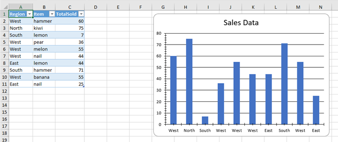
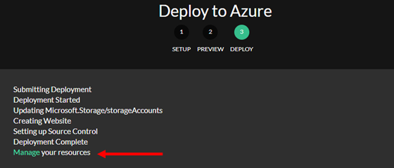
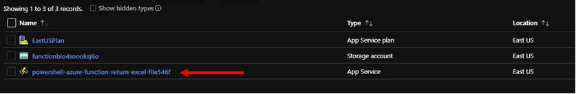
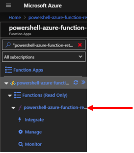
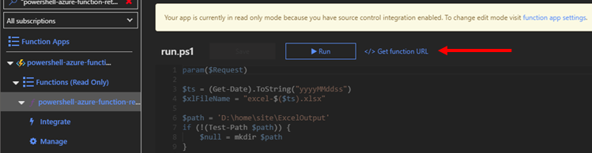
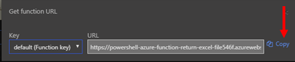

# Powershell Azure Function Return Excel File

<!-- [](https://azuredeploy.net/?repository=https://github.com/dfinke/powershell-azure-function-helloworld/tree/master) -->
[](https://azuredeploy.net/?repository=https://github.com/dfinke/powershell-azure-function-return-excel-file/tree/master)

# Download the Excel File

Click here to try the [live example](https://powershell-azure-function-return-excel-file546f.azurewebsites.net/api/powershell-azure-function-return-excel-file), may take a bit, due to a cold start.

## Expected Excel Results



# After You Deploy to Azure

Once you deploy to Azure, you want to grab the `Url` for the PowerShell Azure Function you created, it looks like this `https://powershell-azure-function-return-excel-file546f.azurewebsites.net/api/powershell-azure-function-return-excel-file`. Follow these few steps to grab it.

Click on the links/buttons pointed to by the red arrows to get the `Function Url`.

#### Step 01


#### Step 02


#### Step 03


#### Step 04


#### Step 05


Now that you have the `Url`, you can paste it into a browser to download the workbook.

[Click here to get the one I generated](https://powershell-azure-function-return-excel-file546f.azurewebsites.net/api/powershell-azure-function-return-excel-file), may take a bit, due to a cold start.

Or use the PowerShell `Invoke-RestMethod` to download the generated Excel file.

```powershell
$uri = 'https://powershell-azure-function-return-excel-file546f.azurewebsites.net/api/powershell-azure-function-return-excel-file'
Invoke-RestMethod -Uri $uri -OutFile .\SalesReport.xlsx
.\SalesReport.xlsx
```